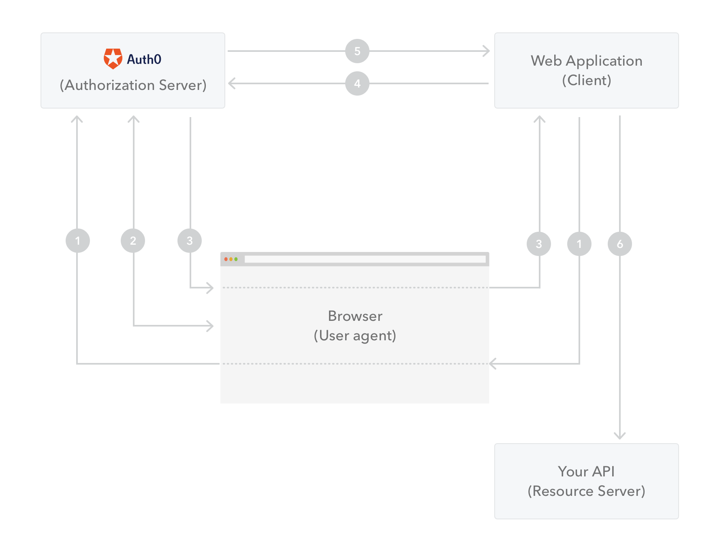
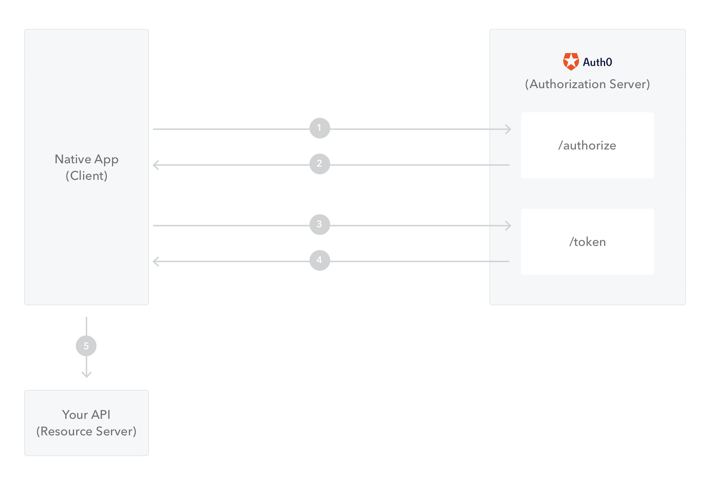
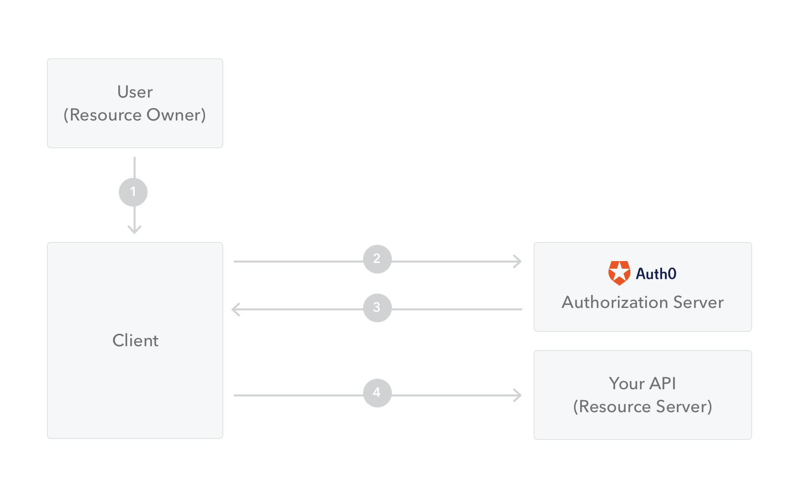
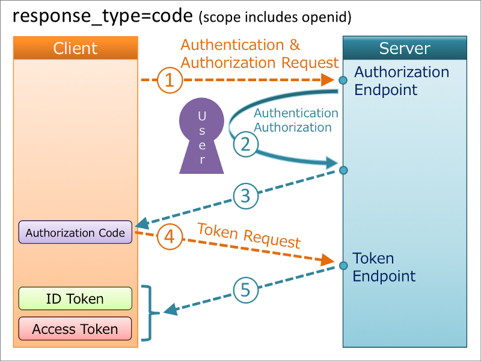
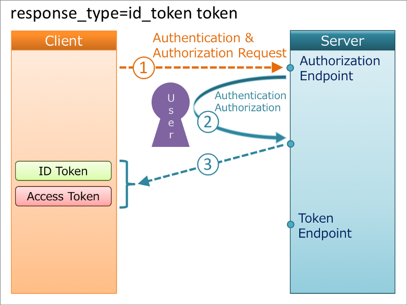
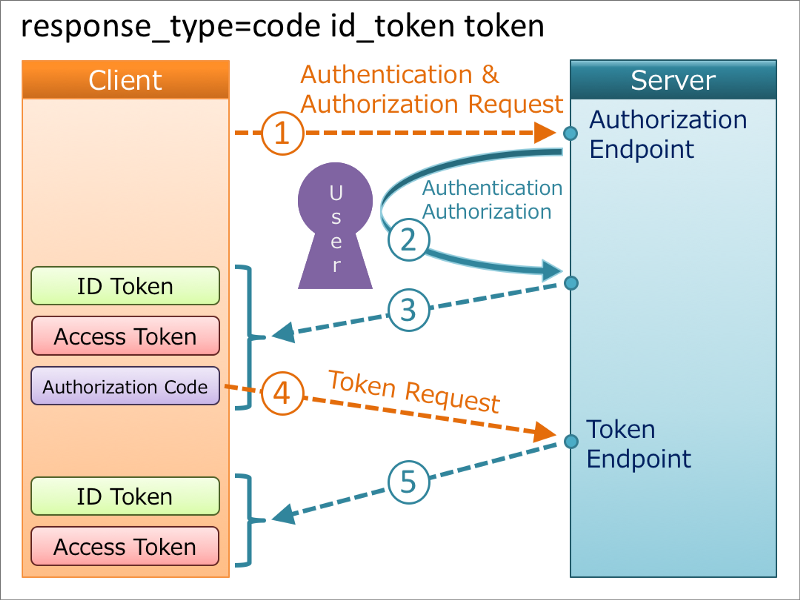

# OAuth2 / OpenID Connect

1. Oauth2

- [Rôles](#Rôles)
- [Oauth Flows](#oauth-flows)
  - [Authorization Code](#authorization-code)
  - [Implicit](#implicit)
  - [Resource Owner Credentials](#resource-owner-credentials)
  - [Client Credentials](#client-credentials)

2. [OpenID Connect (OIDC)](#openid-connect-oidc)

- [Tokens](#tokens)
  - [Access Token](#access-token)
  - [l'ID Token : JWT](#lid-token--jwt)
  - [Refresh Token](#refresh-token)
- [Endpoints](#endpoints)
- [Authorization Flows](#authorization-flows-avec-oidc)
  - [Code Flow](#code-flow)
  - [Implicit Flow](#implicit-flow)
  - [Hybrid Flow](#hybrid-flow)

3. [Pratique](#pratique)

- [Application non protégée](#application-non-protégée)
- [Application du package @axa-fr/react-oidc-context](#application-du-package-axa-frreact-oidc-context)
- [Application du package @axa-fr/react-oidc-context-fetch](#application-du-package-axa-frreact-oidc-context-fetch)

## OAUTH2

Oauth2 est un protocole de gestion d'accès via une application tierce. LA RFC est disponible [ici](https://tools.ietf.org/html/rfc6749)

### Rôles

- **resource owner :**
  Le propriétaire de la ressource. Exemple : Jean-Jacques qui veut se connecter.

- **resource server :**
  Le serveur de contenu protégé. Exemple : le serveur qui contient les comptes bancaires de Jean-Jacques.

- **client :**
  L'application client qui veut accéder au contenu protégé au nom du Resource owner avec son consentement. Exemple : le site Axa Banque.

- **authorization server :**
  Le serveur émettant le token donnant l'accès au contenant après une authentification réussie. Exemple : Axa Connect

### Oauth Flows

#### Authorization Code

Utilisé pour les applications dotées d'un serveur client qui se connectera sur le serveur OAuth.

1. Redirection vers le serveur oauth sur **/authorize**
2. Login/mot de passe \[+Consentement\]
3. Le serveur d'authentification redirige vers la **redirect_uri** avec le token
4. L'application Web, depuis le serveur, envoi l'**authorization_code** au serveur contre un **Access_Token**
5. Le serveur d'authentification valide le code et renvoi un token
6. L'application Web peut utiliser le token pour appeler l'API

#### Authorization Code (PCKE)

Utilisé pour les applications Mobiles

1. L'application redirige vers le serveur oauth sur le /authorize avec un **code_challenge** et la méthode de transformation
2. le serveur redirige l'utilisateur vers l'application avec l'**authorization_code**
3. L'application valide auprès du serveur avec son **code_verifier** et son **authorization_code**
4. Le serveur d'authentification valide le code et renvoi un token
5. L'application peut utiliser le token pour appeler l'API

#### Implicit

Utilisé par les SPA (Single Page Applications)

1. Redirection vers le serveur oauth sur **/authorize**
2. Login/mot de passe \[+Consentement\]
3. Le serveur d'authentification renvoi un access Token \[+ID Token\] pouvant être utilisé par la SPA
4. La SPA peut utiliser l'API avec le token

#### Resource Owner Credentials

Utilisé par les applications de confiance

1. L'utilisateur entre login/MDP directement dans l'app
2. L'application transmet ces informations au serveur OAuth
3. Le serveur renvoi un token après validation
4. L'application peut utiliser l'API avec le Token

#### Client Credentials

Utilisé entre machines (serveur client et Web Service par exemple)

1. Le serveur s'authentifie directement avec **client_id** et **client_secret** auprès du serveur oauth
2. Le serveur OAuth valide les informations et renvoie un **access_token**
3. Le serveur peut utiliser l'API avec le token

## OpenID Connect (OIDC)

OIDC est une surcouche de l'OAuth 2. On prend le même protocole et on l'enrichi avec l'authentification à travers l'**ID_TOKEN** et d'autres joyeusetés.

### Tokens

#### Access Token

Utilisé en **bearer token** lors des communications avec les API, l'**access token** est nécessaire pour accéder aux ressources protégées. Sa durée de vie se doit d'être assez courte car il est vulnérable du fait de son exposition.

#### l'ID Token : JWT

L'authentification auprès du serveur OAuth, nous recevons en plus de l'**access_token**, un **id_token**, jeton autoportant qui contient les informations de l'utilisateur au format [JWT](https://jwt.io/introduction/). C'est ce jeton qui permettra ensuite à l'application d'extraire les informations de base de l'utilisateur. Les différents champs qu'on peut trouver sont sur la [RFC](https://openid.net/specs/openid-connect-core-1_0.html#IDToken)

#### Refresh Token

Le **refresh_token** est utilisé afin de renouveler l'**access_token**. Utilisé pour des session longues et peut être désactivé par un administrateur.

### Endpoints

Un ensemble complet de endpoints est proposé aux applications clientes, la liste est publique sur l'url monserveur/.well-known/openid-configuration. On y retrouve notamment les url d'autorisation de récupération de token, ainsi que la configuration publique du serveur. Voici un exemple de end point : Axa Connect(https://connect.axa.fr/.well-known/openid-configuration)

### Authorization Flows avec OIDC

Avec OIDC, nous retrouvons les même Flows mais avec des petites différences au niveau des demandes de token. Pour jouer avec ça nous devons modifier la valeur du response_type avec les valeurs suivantes possibles :

- code : Dans le cas de l'authorization Flow
- token : Pour Récupérer un **access_token**
- id_token : Pour récupérer un **id_token**
- none : Ne retourne rien

Les trois premiers peuvent être combinés ensemble. Voici quelques exemples

#### Code Flow

Pour application avec backend
response-type : code

#### Implicit Flow

Pour SPA
response-type : id_token et/ou token

#### Hybrid Flow

Pour SPA
response-type : code id_token et/ou token

Sources Utilisées pour les schémas :
https://openid.net/developers/specs/

https://auth0.com/docs/apis

https://medium.com/@darutk/diagrams-of-all-the-openid-connect-flows-6968e3990660
